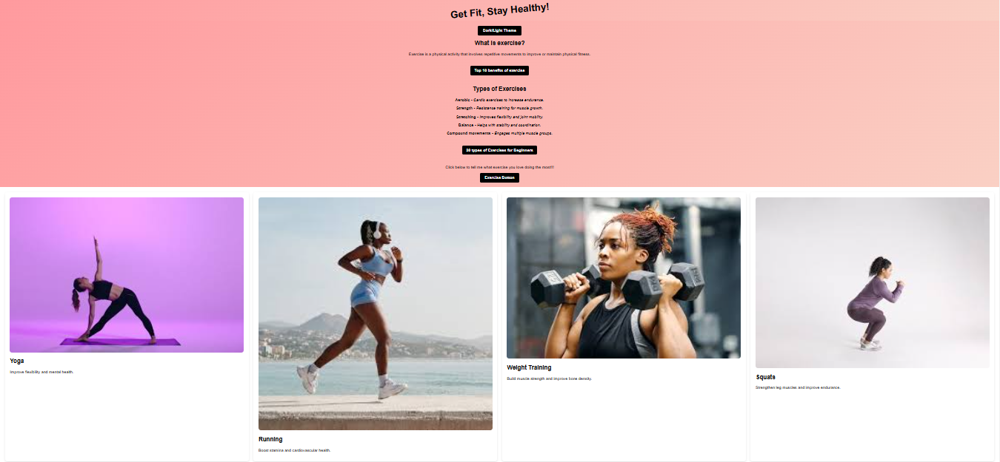

# exercise-landing-page

## 📌 Description
The Exercise Landing Page is a simple and interactive webpage designed to promote fitness and a healthy lifestyle. It provides information on different types of exercises, their benefits, and encourages users to engage in physical activity. The page features a dark/light mode toggle, interactive elements, and visually appealing exercise sections.

## 🛠 Prerequisites
A web browser (Chrome, Firefox, Safari, etc.) to view the page.
No specific server setup is required as this is a static HTML, CSS, and JavaScript project.

## 📋 Criteria
* Provides educational content on different types of exercises.
* Includes an interactive button to engage users.
* Features a dark/light mode toggle for better user experience.
* Implements a responsive and visually appealing layout.
 
 ## 💻 Technologies Used
This project was built using:
* HTML
* CSS
* JavaScript

## 🚀 Installation
No installation required. Simply open the web application in your browser.

## 📚 Usage
1. Click the Dark/Light Theme button to switch themes.
2. Read about different types of exercises and their benefits.
3. Click the Exercise Button to enter your name and favorite exercise, receiving a personalized message.
4. Follow the provided links for additional fitness resources.

## 🔗 Live Demo & Repository
Application can be viewed here: 
* [Live](https://ya-exercise-landing-page.netlify.app/)

* [Repository](https://github.com/yvonnesarah/exercise-landing-page)

## 🖼 Screenshot
Below is a preview of Exercise Landing Page:

## 👥 Credit
Resources from Healthline, Village Gym

## 📜 License
This project is open-source. For licensing details, please refer to the LICENSE file in the repository.

## 📬 Contact
You can reach me at 📧 yvonneadedeji.sarah@gmail.com.
