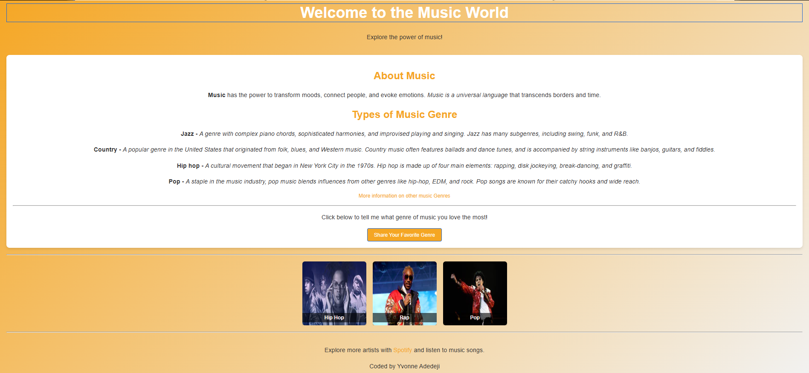
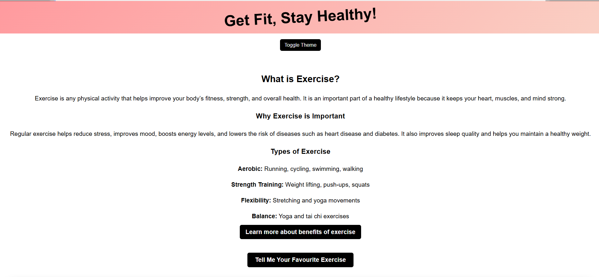
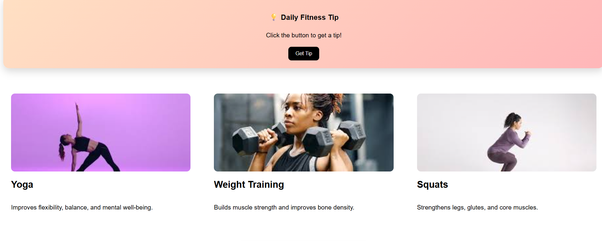
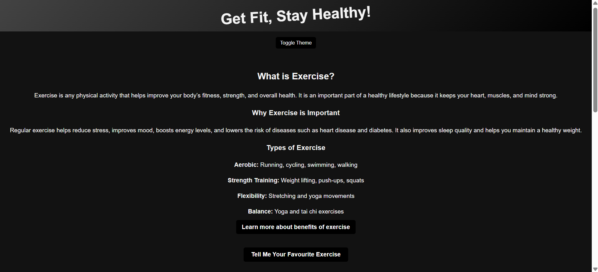

# exercise-landing-page

## 📌 Description
The Exercise Landing Page is a visually engaging, responsive static web application designed to promote physical activity and healthy living. It provides an interactive experience where users can explore different types of exercises, take a short fitness quiz, and receive motivational fitness tips.

The page features a modern gradient design, smooth hover animations, and a light/dark mode toggle. It showcases exercises such as Yoga, Weight Training, and Squats, and includes multiple interactive JavaScript features like a quiz system, tip generator, and personalized user prompts.

## 🛠 Prerequisites
To run and interact with this project, ensure you have:
* 🌐 A modern web browser such as Chrome, Firefox, Safari, or Edge
* 📶 Internet connection (for external images and links)

No installation, build tools, or server setup is required since this is a static web application.

## 📋 Features
* 🎨 Modern gradient header design
* 🌙 Light/Dark mode toggle
* 🖼 Interactive exercise gallery
* 🖱 Hover animations on exercise cards and images
* 📱 Fully responsive layout (mobile & desktop)
* 💪 Informational sections about exercise and health
* 🏃‍♂️ Exercise categories (Yoga, Strength Training, Flexibility, Balance)
* 🔘 Interactive prompt button (name + favourite exercise)
* 💬 Personalized user message based on input
* 🧠 Interactive fitness quiz with scoring system
* 🔄 Quiz restart functionality
* 💡 Daily fitness tip generator
* 📌 Click-to-select exercise highlighting
* ⬆ Back-to-top button with smooth scrolling
* 🔗 External link to exercise benefits (Healthline)
* ⚡ Lightweight vanilla JavaScript interactivity

 ## 💻 Technologies Used
This project was built using:
* HTML
* CSS
* JavaScript
* External Image URLs (for exercise visuals)
* External Link (Healthline article)

## 🚀 Installation
No installation required. Simply open the web application in your browser.

## 📚 Usage
1. Open the landing page in your browser
2. Read the introduction about exercise
3. Explore exercise cards (Yoga, Weight Training, Squats)
4. Click cards to highlight them
5. Toggle between light and dark mode 🌙
6. Click “Tell Me Your Favourite Exercise”
7. Enter your name and favourite exercise
8. Take the interactive fitness quiz 🧠
9. View your final score and restart the quiz
10. Click “Get Tip” for a daily fitness tip 💡
11. Use the back-to-top button ⬆ when scrolling

## 🔗 Live Demo & Repository
Application can be viewed here: 
* [Live](https://yvonnesarah.github.io/exercise-landing-page/)

* [Repository](https://github.com/yvonnesarah/exercise-landing-page)

## 🖼 Screenshot(S)
Before Design

Exercise Landing Page

After Design

Exercise Landing Page

Exercise Landing Page - Tip and images

Exercise Landing Page - Quiz

Exercise Landing Page - Dark Theme

## 👥 Credit
Designed and developed by Yvonne Adedeji.

This project makes use of the following resources:
* 🖼 Public Image Sources – Exercise visuals

* 📚 Healthline – Exercise benefits reference

## 📜 License
This project is open-source. For licensing details, please refer to the LICENSE file in the repository.

## 📬 Contact
You can reach me at 📧 yvonneadedeji.sarah@gmail.com.
